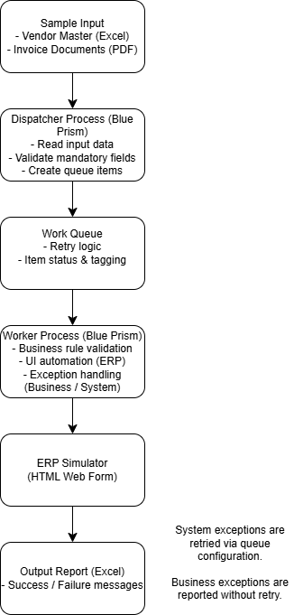

# Invoice Processing Automation (Blue Prism + Python)

## Overview

This project demonstrates an end-to-end **Invoice Processing Automation** built using:

- **Blue Prism** (Orchestration & UI Automation)
- **Python (PyMuPDF)** for text-based PDF extraction

The solution follows enterprise RPA design principles including:

- Dispatcher–Worker architecture
- Work Queue with retry logic
- Structured Business vs System exception handling
- Modular integration with external components
- Clean separation of concerns

---

## Architecture Overview



### High-Level Flow

1. Dispatcher scans input folder and creates queue items
2. Worker processes each invoice transaction
3. Worker calls external Python module for PDF extraction
4. Extracted data is validated
5. Invoice is posted to ERP Simulator
6. Results are logged in output report

---

## Technology Stack

| Component | Technology |
|------------|------------|
| Orchestration | Blue Prism |
| PDF Extraction | Python (PyMuPDF) |
| Queue Management | Blue Prism Work Queue |
| ERP Target | HTML-based ERP Simulator |
| Reporting | Excel Output |

---

## Hybrid Architecture Pattern

This solution follows a modular integration approach:

Blue Prism (Worker)
↓
Python Script (PDF Extraction)
↓
JSON Response
↓
Validation + ERP Posting


Blue Prism handles:
- Queue management
- Exception routing
- ERP automation
- Reporting

Python handles:
- PDF text extraction
- Field parsing
- Structured JSON output

---

## PDF Extraction Module

Located in:

python/pdf_invoice_extract.py


### Features

- Extracts text from **text-based PDFs**
- Parses:
  - Invoice Number
  - Invoice Date
  - Due Date
  - PO Number
  - Vendor Name
  - Subtotal
  - Tax
  - Total
- Returns structured JSON
- Supports exit codes for automation control

### Limitation

Only **text-based PDFs** (selectable text) are supported.  
Scanned/image-based PDFs (OCR) are out of scope for this version.

---

## Installation

### 1. Install Python Dependencies

```bash
pip install -r requirements.txt

How to Run
Step 1 — Place Input PDFs
sample-data/input/

Step 2 — Run Dispatcher

Scans input folder

Creates queue items with PdfPath

Step 3 — Run Worker

For each queue item:

Calls Python script

Validates extracted fields

Posts to ERP simulator

Writes output report

Marks item Completed or Exception

Exception Handling Strategy
Business Exceptions

Raised when:

Required fields missing

Validation fails

Vendor not found

Total mismatch

No retry.

System Exceptions

Raised when:

Script execution fails

File read error

Unexpected runtime issue

Retries handled via Work Queue configuration.

invoice-automation-blueprism/
├── blueprism/
│   └── releases/
├── docs/
│   ├── architecture.png
│   ├── runbook.md
│   └── erp-simulator/
├── sample-data/
│   ├── input/
│   └── output/
├── python/
│   ├── pdf_invoice_extract.py
│   └── README.md
├── README.md

Design Highlights

Modular architecture

Clean separation of orchestration and parsing logic

Production-style exception handling

Reusable Python component

Deterministic parsing (no AI dependency)

Safe dummy data usage

Why This Design

This project demonstrates how RPA solutions can:

Integrate with external components

Delegate specialized processing to dedicated services

Maintain scalability and maintainability

Follow real-world enterprise patterns

Notes

All data used is sample/demo data

No real ERP system is used

ERP Simulator is HTML-based

Designed for portfolio and learning purposes

Author

Shikha Rani
Blue Prism Consultant


